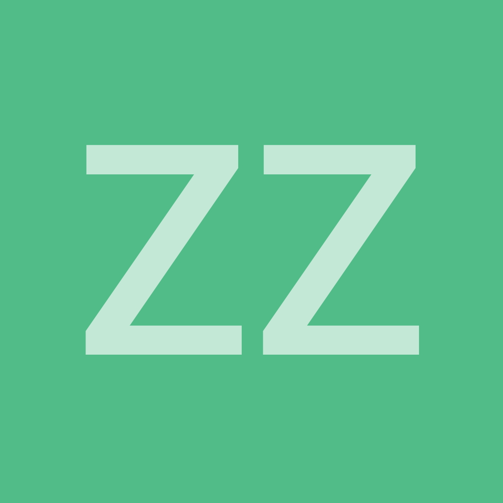
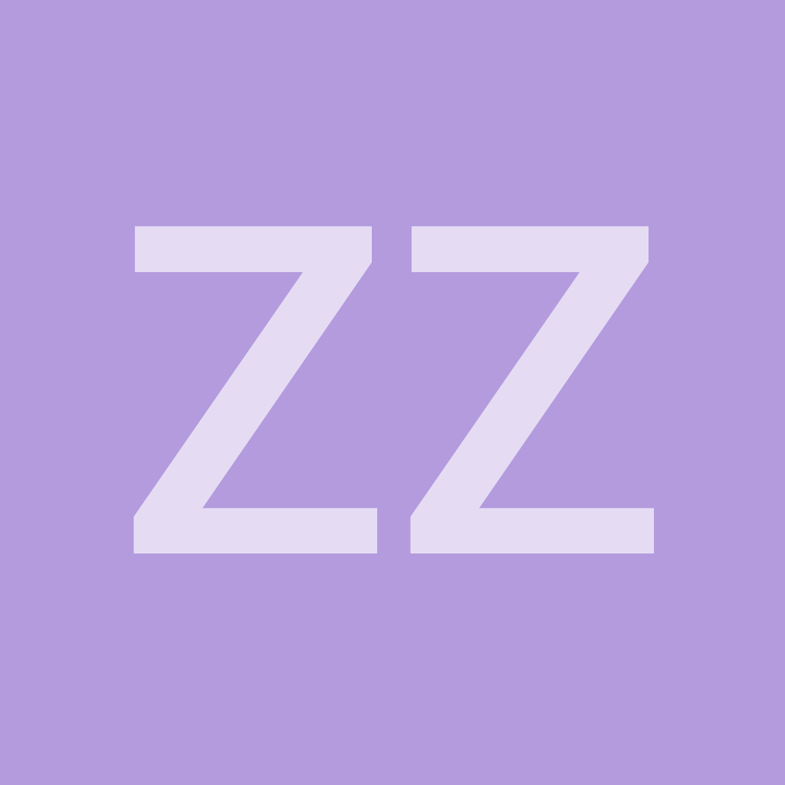
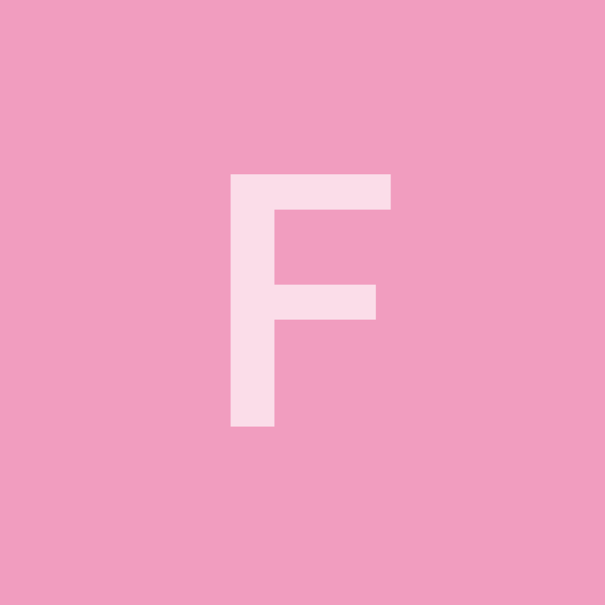
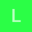

# LetterAvatarSimple

Generate letter image avatars based on user initials.

## Usage

```ruby
LetterAvatarSimple.generate("foobar")
# => #<StringIO:0x000055b3804948a8>
```


------------

We can do multiple letters:

```ruby
LetterAvatarSimple.generate("Dallas Smith")
# => #<StringIO:0x000055b380e6a058>
```


------------

We can save to a file:

```ruby
LetterAvatarSimple.generate_file("Dallas Smith")
# => #<File:/tmp/x20190527-19344-79m629.png>

LetterAvatarSimple.generate_file("Dallas Smith", filename: "/tmp/dallas.png")
# => #<File:/tmp/dallas.png>
```

------------

We can specify the initials using `LetterAvatarSimple::Identity`:

```ruby
i = LetterAvatarSimple::Identity.new("ZZ", "Dallas Smith")
LetterAvatarSimple.generate(i)
```



------------

Image color is chosen from a palette based on username, so the same initials
will (most likely) not share the same color:

```ruby
i = LetterAvatarSimple::Identity.new("ZZ", "foobar")
LetterAvatarSimple.generate(i)
```



------------

The default palette is based on Google Inbox. You can change palettes:

```ruby
LetterAvatarSimple.generate("foobar", palette: :i_want_hue)
```



------------

Or skip the palette feature and provide the desired color directly, in RGB tuple format:

```ruby
LetterAvatarSimple.generate("foobar", color: [255,0,0])
```


------------

Other options that can be provided to customize image generation:

```ruby
LetterAvatarSimple.generate(
  "foobar",
  size: 256,                            # => default 1024
  palette: :i_want_hue,                 # => default :google
  # warning: this bypasses the palette's color selection
  color: [255, 0, 0]                    # => default nil
  pointsize: 150,                       # => default 600
  font: "/tmp/path/to/font/file",       # => default is path to included Roboto font
  weight: 500,                          # => default 300
  fill_color: "rgba(255, 255, 255, 1)", # => default "rgba(255, 255, 255, 0.65)"
  annotate_position: "-0+10",           # => default "-0+5"
  filename: "/tmp/foo.png",             # => default is randomly generated tempfile path
)
```

## About

Forked from [letter_avatar][], which was in turn extracted from [Discourse][].

Compared to [letter_avatar][], this gem:
  * Outputs `StringIO` binary data by default (but can write to files too!)
    instead of always writing files to the `public` directory. This way you can
    use image upload gems like [shrine][] much easier
  * Supports keyword arguments for generating each image (don't need to edit
    global config or constants)
  * Simplifies custom palette loading and supports multiple custom palettes
  * Uses [minimagick][] instead of homegrown ImageMagick shell execution
  * Does **not** come with model, view, or controller helpers (you should
    be using [shrine][])
  * Does **not** do caching (you should be using [shrine][])

## Installation

```ruby
gem "letter_avatar_simple"
```

## System requirements

ImageMagick or GraphicsMagick - see
[MiniMagick requirements](https://github.com/minimagick/minimagick#requirements)

## Color palettes

Two color palettes are provided by default: `:google` and `:i_want_hue`

Both palettes use an MD5 digest of the username to select the color, so it's
likely that two different usernames that share the same initial(s) will render
with different colors.

If you need the same initials to always render with the same color, simply
provide a custom palette using a customized `letter_color` method. See below
for an example.

### `:google` - Google Inbox palette

<!--
alphabet = ("A".."Z").cycle

pairs = LetterAvatarSimple::Palettes::Google::PALETTE.zip(alphabet)

pairs.each do |color,letter|
  filename = "./examples/readme/google-palette/#{letter}.png"
  LetterAvatarSimple.generate_file(
    letter,
    color: color,
    filename: filename,
    size: 64,
    pointsize: 37.5,
    annotate_position: "-0+0"
  )
end
-->


### `:i_want_hue` - [iWantHue][] palette

<!--
alphabet = ("A".."Z").cycle

pairs = LetterAvatarSimple::Palettes::IWantHue::PALETTE.zip(alphabet)

f = File.open("/tmp/i_want_hue.txt", "w")
pairs.each_with_index do |(color,letter),i|
  filename = "./examples/readme/i_want_hue-palette/#{i}-#{letter}.png"
  LetterAvatarSimple.generate_file(
    letter,
    color: color,
    filename: filename,
    size: 64,
    pointsize: 37.5,
    annotate_position: "-0+0"
  )
  f.puts <<~HTML
    
  HTML
end
f.close
-->





... <a href="./examples/readme/i_want_hue-palette">and 157 more!</a>
</details>

### Custom palettes

You can add your own custom palette:

```ruby
LetterAvatarSimple.palettes[:my_palette] = LetterAvatarSimple::Palette.new([
  [120, 132, 205],
  [91, 149, 249],
  [72, 194, 249],
  [69, 208, 226],
])
# The default method of selecting the color is by MD5 digest of the username. You
# can change this behavior by providing a letter_color method.
LetterAvatarSimple.palettes[:my_palette].tap do |p|
  def p.letter_color(identity)
    if identity.id == "admin"
      [255, 0, 0] # red
    elsif identity.id == "bozo"
      @palette.sample # random
    else
      # same initials = same color
      digest = Digest::MD5.hexdigest(identity.letters.to_s)
      @palette[digest[0...15].to_i(16) % @palette.length]
    end
  end
end

LetterAvatarSimple.generate_file("foobar", palette: :my_palette)
```

## Configuration

The same options that can be passed to `generate` can be set as global defaults:

```ruby
LetterAvatarSimple.config do |config|
  config.size              = 256
  config.palette           = :i_want_hue
  config.color             = [255, 0, 0]
  config.pointsize         = 150
  config.font              = "/tmp/path/to/font/file"
  config.weight            = 500
  config.fill_color        = "rgba(255, 255, 255, 1)"
  config.annotate_position = "-0+10"
end
```

[letter_avatar]: https://github.com/ksz2k/letter_avatar
[minimagick]: https://github.com/minimagick/minimagick
[shrine]: https://github.com/shrinerb/shrine
[Discourse]: https://www.discourse.org/
[iWantHue]: http://tools.medialab.sciences-po.fr/iwanthue/index.php
